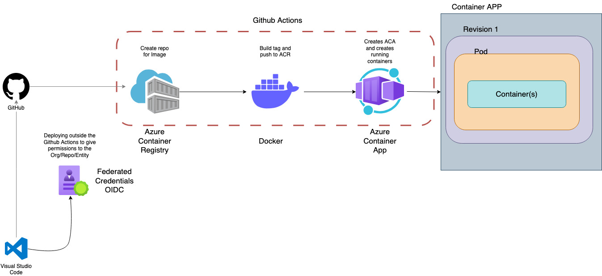

# Docker Runner for Github in Azure

  

Deployed with Pulumi we are creating the following resources
- ACR (Azure Container Registry) 
- ACA (Azure Container App)
- Resource Group

to deploy each resource in the correct order, deploy the ACR repo first so we can then push the github images into the ACR Repo to reuse in ACA. 

